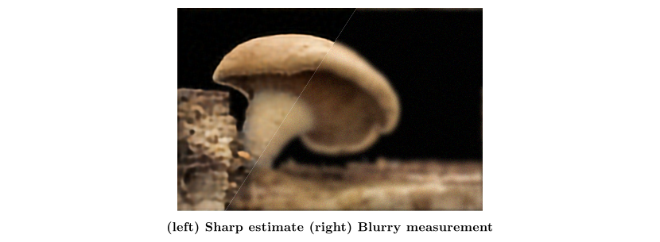

# Self-Supervised Learning for Image Super-Resolution and Deblurring

The implementation of ["Self-Supervised Learning for Image Super-Resolution and Deblurring"](https://arxiv.org/abs/2312.11232) by [Jérémy Scanvic](https://github.com/jscanvic), [Mike Davies](https://www.research.ed.ac.uk/en/persons/michael-davies), [Patrice Abry](http://perso.ens-lyon.fr/patrice.abry/index.html), and [Julián Tachella](https://tachella.github.io/)


## Results




Sample deblurring results using the proposed self-supervised method and the supervised baseline


## Getting Started

1. Clone the repository
```sh
git clone https://github.com/jscanvic/Scale-Equivariant-Imaging
cd Scale-Equivariant-Imaging
```
2. Install the requirements
```sh
pip install -r requirements.txt
```

## Training a model

You can train a model using one of the methods used in the paper, i.e. the proposed, supervised, and CSS methods, and equivariant imaging methods using shifts and rotations. The resulting weights are written to disk and can be tested as explained in the testing section. Additionally, the training state (i.e. model weights, optimizer state, etc.) is saved at different epochs to allow for resuming training. A sample usage of the training script is written below, along with an explanation of each flag.

```sh
python demo/train.py --device cuda:0 \
 --method proposed \
 --task deblurring \
 --kernel Gaussian_R2 \
 --out_dir ./results \
 --download
```

| Flag                 | Explanation                                                               |
|----------------------|---------------------------------------------------------------------------|
| `--dataset`          | Training dataset, i.e. `div2k` (default), `urban100` or `ct`              |
| `--method`           | Training method, i.e. `proposed`, `sup`, `css`, `ei-shift` or `ei-rotate` |
| `--no-stop_gradient` | Don't stop the gradient in the equivariant loss                           |
| `--task`             | Task, i.e. `deblurring` or `sr`                                           |
| `--sr_factor`        | Super-resolution factor, i.e. `2` or `4` (optional)                       |
| `--kernel`           | Kernel name for deblurring, e.g. `Gaussian_R2` or `Box_R3` (optional)     |
| `--noise_level`      | Noise level, e.g. 5 (default)                                             |
| `--out_dir`          | Directory used for saving training checkpoints and final weights          |
| `--device`           | PyTorch device, e.g. `cpu` (default) or `cuda:0`                          |
| `--download`         | Automatically download the training dataset if needed                     |

## Testing a model

You can test a model with precomputed weights used in the paper, which we made available on [Hugging Face 🤗](https://huggingface.co/jscanvic/scale-equivariant-imaging/tree/main), or with weights you obtained by training a model. The resulting PSNR and SSIM are written to the standard output. A sample usage of the testing script is written below, along with an explanation of each flag.

```sh
python demo/test.py --device cuda:0 --task deblurring \
 --kernel Gaussian_R2 \
 --weights Deblurring_Gaussian_R2_Noise5_Proposed \
 --download
```

| Flag            | Explanation                                                                                                                                                                                   |
|-----------------|-----------------------------------------------------------------------------------------------------------------------------------------------------------------------------------------------|
| `--dataset`     | Test dataset, i.e. `div2k` (default), `urban100` or `ct`                                                                                                                                      |
| `--task`        | Task, i.e. `deblurring` or `sr`                                                                                                                                                               |
| `--sr_factor`   | Super-resolution factor, i.e. `2` or `4` (optional)                                                                                                                                           |
| `--kernel`      | Kernel name for deblurring, e.g. `Gaussian_R2` or `Box_R3` (optional)                                                                                                                         |
| `--noise_level` | Noise level, e.g. 5 (default)                                                                                                                                                                 |
| `--model_kind`  | Kind of algorithm used for reconstruction, i.e. `swinir` (default), `dip`, `pnp`, `bm3d`, `up` or `id`                                                                                        |
| `--weights`     | Path to the weights or name of a pretrained model, e.g. `Deblurring_Gaussian_R2_Noise5_Proposed` (See [Hugging Face 🤗](https://huggingface.co/jscanvic/scale-equivariant-imaging/tree/main)) |
| `--device`      | PyTorch device, e.g. `cpu` (default) or `cuda:0`                                                                                                                                              |
| `--download`    | Automatically download the test dataset if needed                                                                                                                                             |

## Citation

```bibtex
@article{scanvic2023self,
	title={Self-Supervised Learning for Image Super-Resolution and Deblurring},
	author={Scanvic, J{\'e}r{\'e}my and Davies, Mike and Abry, Patrice and Tachella, Juli{\'a}n},
	journal={arXiv preprint arXiv:2312.11232},
	year={2023}
}
```
