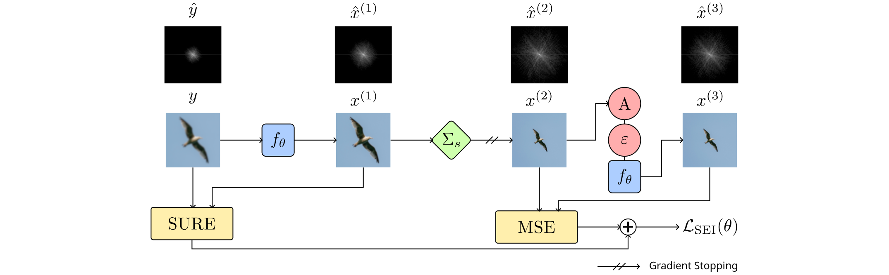

## Scale-Equivariant Imaging: Self-Supervised Learning for Image Super-Resolution and Deblurring<br><sub>Official PyTorch implementation, IEEE TCI 2026</sub>

[](https://arxiv.org/abs/2312.11232)
[](https://github.com/jscanvic/Scale-Equivariant-Imaging)
[](10.1109/TCI.2026.3660011)



**Scale-Equivariant Imaging: Self-Supervised Learning for Image Super-Resolution and Deblurring**<br>
[Jérémy Scanvic](https://jeremyscanvic.com), [Mike Davies](https://www.research.ed.ac.uk/en/persons/michael-davies), [Patrice Abry](https://perso.ens-lyon.fr/patrice.abry), [Julián Tachella](https://tachella.github.io)

Abstract: *Self-supervised methods have recently proved to be nearly as effective as supervised ones in various imaging inverse problems, paving the way for learning-based approaches in scientific and medical imaging applications where ground truth data is hard or expensive to obtain. These methods critically rely on invariance to translations and/or rotations of the image distribution to learn from incomplete measurement data alone. However, existing approaches fail to obtain competitive performances in the problems of image super-resolution and deblurring, which play a key role in most imaging systems. In this work, we show that invariance to roto-translations is insufficient to learn from measurements that only contain low-frequency information. Instead, we propose scale-equivariant imaging, a new self-supervised approach that leverages the fact that many image distributions are approximately scale-invariant, enabling the recovery of high-frequency information lost in the measurement process. We demonstrate throughout a series of experiments on real datasets that the proposed method outperforms other self-supervised approaches, and obtains performances on par with fully supervised learning.*

### Results


Sample deblurring results using the proposed self-supervised method and the supervised baseline


### Getting Started

For better reproducibility, we recommend using Python 3.12.1.

1. Clone the repository
```sh
git clone https://github.com/jscanvic/Scale-Equivariant-Imaging
cd Scale-Equivariant-Imaging
```
2. Install the requirements
```sh
pip install -r requirements.txt
```

Make sure to run the scripts with the `src` directory in the `PYTHONPATH` environment variable.

```sh
export PYTHONPATH=src
```

### Training a model

You can train a model using one of the methods used in the paper, i.e. the proposed, supervised, and CSS methods, and equivariant imaging methods using shifts and rotations. The resulting weights are written to disk and can be tested as explained in the testing section. Additionally, the training state (i.e. model weights, optimizer state, etc.) is saved at different epochs to allow for resuming training. A sample usage of the training script is written below, along with an explanation of each flag.

```sh
python demo/train.py --device cuda:0 \
 --method proposed \
 --task deblurring \
 --kernel Gaussian_R2 \
 --out_dir ./results \
 --download
```

| Flag                 | Explanation                                                               |
|----------------------|---------------------------------------------------------------------------|
| `--dataset`          | Training dataset, i.e. `div2k` (default), `urban100` or `ct`              |
| `--method`           | Training method, i.e. `proposed`, `sup`, `css`, `ei-shift` or `ei-rotate` |
| `--no-stop_gradient` | Don't stop the gradient in the equivariant loss                           |
| `--task`             | Task, i.e. `deblurring` or `sr`                                           |
| `--sr_factor`        | Super-resolution factor, i.e. `2` or `4` (optional)                       |
| `--kernel`           | Kernel name for deblurring, e.g. `Gaussian_R2` or `Box_R3` (optional)     |
| `--noise_level`      | Noise level, e.g. 5 (default)                                             |
| `--out_dir`          | Directory used for saving training checkpoints and final weights          |
| `--device`           | PyTorch device, e.g. `cpu` (default) or `cuda:0`                          |
| `--download`         | Automatically download the training dataset if needed                     |

### Testing a model

You can test a model with precomputed weights used in the paper, which we made available on [Hugging Face 🤗](https://huggingface.co/jscanvic/scale-equivariant-imaging/tree/main), or with weights you obtained by training a model. The resulting PSNR and SSIM are written to the standard output. A sample usage of the testing script is written below, along with an explanation of each flag.

```sh
python demo/test.py --device cuda:0 --task deblurring \
 --kernel Gaussian_R2 \
 --weights Div2K-Train_Deblurring_Gaussian_R2_Noise5_SEI \
 --download
```

| Flag            | Explanation                                                                                                                                                                                   |
|-----------------|-----------------------------------------------------------------------------------------------------------------------------------------------------------------------------------------------|
| `--dataset`     | Test dataset, i.e. `div2k` (default), `urban100`, `ct` or path to a directory                                                                                                                                      |
| `--task`        | Task, i.e. `deblurring` or `sr`                                                                                                                                                               |
| `--sr_factor`   | Super-resolution factor, i.e. `2` or `4` (optional)                                                                                                                                           |
| `--kernel`      | Kernel name for deblurring, e.g. `Gaussian_R2` or `Box_R3` (optional)                                                                                                                         |
| `--noise_level` | Noise level, e.g. 5 (default)                                                                                                                                                                 |
| `--model_kind`  | Kind of algorithm used for reconstruction, i.e. `swinir` (default), `dip`, `pnp`, `bm3d`, `up` or `id`                                                                                        |
| `--weights`     | Path to the weights or name of a pretrained model, e.g. `Deblurring_Gaussian_R2_Noise5_Proposed` (See [Hugging Face 🤗](https://huggingface.co/jscanvic/scale-equivariant-imaging/tree/main)) |
| `--device`      | PyTorch device, e.g. `cpu` (default) or `cuda:0`                                                                                                                                              |
| `--download`    | Automatically download the test dataset if needed                                                                                                                                             |

### Citation

```bibtex
@article{scanvic2026scale,
  author={Scanvic, Jérémy and Davies, Mike and Abry, Patrice and Tachella, Julián},
  journal={IEEE Transactions on Computational Imaging},
  title={Scale-Equivariant Imaging: Self-Supervised Learning for Image Super-Resolution and Deblurring},
  year={2026},
  volume={},
  number={},
  pages={1-11},
  keywords={Imaging;Superresolution;Inverse problems;Noise;Noise measurement;Image reconstruction;Deblurring;Bandwidth;Loss measurement;Self-supervised learning;Self-supervised learning;imaging inverse problems},
  doi={10.1109/TCI.2026.3660011}
}
```
